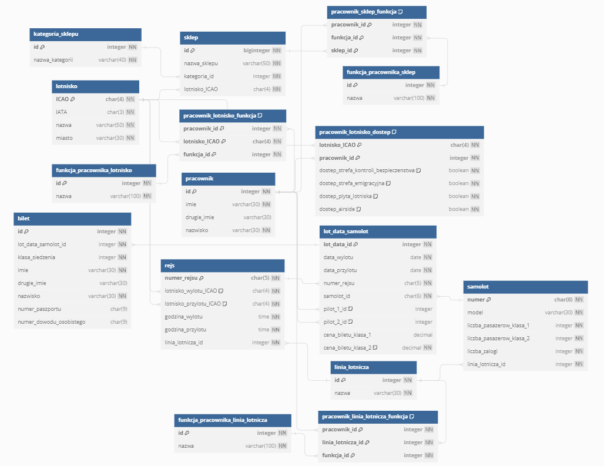

# Airport Manager - PostgreSQL Database Project
The repository contains SQL scripts creating the structure of the database and adding sample data. This database was created for a project assignment in the Database 1 course. The application and database use the Polish language as it is a requirement for the project assignment. 
**Repository Link:** [Airport Manager Repository](https://github.com/k-czerwinski/manager-lotniczy)

## Database Structure

The repository contains SQL scripts creating the structure of the database and adding sample data. This database was created for a project assignment in the Database 1 course. The application and database use the Polish language as it is a requirement for the project assignment.

### Entity-Relationship Diagram (ERD):

## Technical Aspects

The project utilizes various PostgreSQL functionalities, including:

- **Views:** Views allow the creation of virtual tables that can be used in SQL queries. Views are used in the project to simplify queries and facilitate data analysis.
- **CTE (Common Table Expressions):** CTEs allow the creation of temporary tables that can be used in SQL queries. CTEs are used in the project to simplify queries and facilitate data analysis.
- **Loops:** Loops allow the repetition of operations in SQL queries. Loops are used in the project to automate business processes.
- **Functions:** Functions allow the creation of custom functions in SQL. Functions are used in the project to simplify queries and facilitate data analysis.
- **User Roles:** User roles control access to the database. The project uses admin and client roles, determining access permissions to tables and views.
- **Constraints:** Constraints validate data inserted into the database.

## Normalization

Tables have been optimized according to the three normal forms.

#### First Normal Form

In this step, several new tables were created to avoid redundancy:

- The "sklep_kategoria" table containing information about the store category was separated from the "sklep" table.
- For each type of employee, separate tables for functions related to that type of employee were created.

#### Second Normal Form

In this step, the following operations were performed:

- Instead of creating three separate tables (airport employee, store employee, airline employee), a single table containing information about all employees was created. The primary key in this table is used in separate tables to specify employee functions, workplaces, and access.

#### Third Normal Form

For this principle, no further table divisions were decided.

## Documentation
Additional documentation is available language here: [documentation](./docs)
